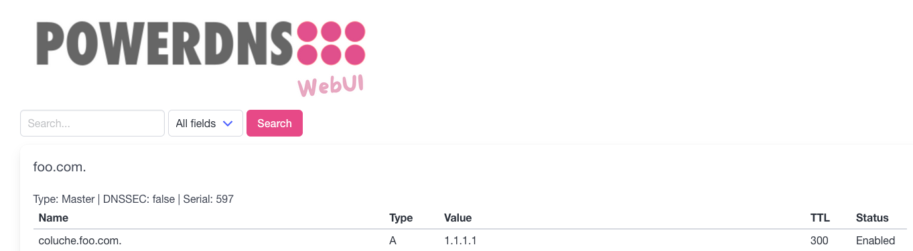

## Description

**PowerDNS-WebUI** is a web user interface for reading and searching DNS zones managed by a PowerDNS server via its REST API.



## Features

- Display DNS zones and their records.
- Advanced search by name, type, or content of DNS records.
- Modern user interface based on [Bulma](https://bulma.io/).

## Prerequisites

- Go 1.24 or higher.
- A PowerDNS server configured with the REST API enabled.

## Installation on Linux with systemd

### Step 1: Create a dedicated user

For security purposes, create a dedicated user to run the application:

```bash
sudo useradd -r -s /bin/false powerdns-webui
```

### Step 2: Set up the directory structure

Create the necessary directories for the application and its configuration:

```bash
sudo mkdir -p /opt/powerdns-webui
sudo mkdir -p /etc/powerdns-webui
sudo chown -R powerdns-webui:powerdns-webui /opt/powerdns-webui /etc/powerdns-webui
```

### Step 3: Copy the application and configuration

1. Build the application:

   ```bash
   make build
   ```

2. Copy the binary to `/opt/powerdns-webui`:

   ```bash
   sudo cp ./build/powerdns-webui /opt/powerdns-webui/
   sudo chown powerdns-webui:powerdns-webui /opt/powerdns-webui/powerdns-webui
   ```

3. Copy the configuration file to `/etc/powerdns-webui`:

   ```bash
   sudo cp ./config.toml /etc/powerdns-webui/
   sudo chown powerdns-webui:powerdns-webui /etc/powerdns-webui/config.toml
   ```

### Step 4: Create a systemd service file

Create a systemd service file at `/etc/systemd/system/powerdns-webui.service`:

```bash
sudo nano /etc/systemd/system/powerdns-webui.service
```

Add the following content:

```ini
[Unit]
Description=PowerDNS WebUI
After=network.target

[Service]
User=powerdns-webui
Group=powerdns-webui
WorkingDirectory=/opt/powerdns-webui
ExecStart=/opt/powerdns-webui/powerdns-webui --config /etc/powerdns-webui/config.toml
Restart=always
RestartSec=5
Environment="PORT=8080"

[Install]
WantedBy=multi-user.target
```

### Step 5: Start and enable the service

Reload `systemd` to apply the new service file, then start and enable the service:

```bash
sudo systemctl daemon-reload
sudo systemctl start powerdns-webui
sudo systemctl enable powerdns-webui
```

### Step 6: Verify the service

Check the status of the service to ensure it is running:

```bash
sudo systemctl status powerdns-webui
```

You should see output indicating that the service is active and running.

### Step 7: Access the application

Open a web browser and navigate to the following URL (replace `0.0.0.0` with your server's IP address if necessary):

```
http://0.0.0.0:8080
```

### Notes

- To update the configuration, edit `/etc/powerdns-webui/config.toml` and restart the service:

  ```bash
  sudo systemctl restart powerdns-webui
  ```
  
- Logs can be viewed using `journalctl`:
  ```bash
  sudo journalctl -u powerdns-webui -f
  ```

## Usage

### Running the Application

To run the application, use the following command:

```bash
./build/powerdns-webui --config config.toml
```

### Global Options

```bash
GLOBAL OPTIONS:
   --config value        Path to the configuration file (TOML format) [$CONFIG_FILE]
   --help, -h            show help
```

### Configuration Example

Create a `config.toml` file with the following content:

```toml
powerdns_url = "http://localhost:8081"
api_key = "my_awesome_api_key"
server_id = "localhost"
listen_address = "0.0.0.0"
port = "8080"
```

## Development

### Running in Development Mode

To run the application in development mode:

```bash
make run
```

### Tests

To run unit tests:

```bash
make test
```

## Contribution

Contributions are welcome! Please submit a pull request or open an issue to report a problem or suggest an improvement.

## License

This project is licensed under the MIT License. See the `LICENSE` file for more details.
